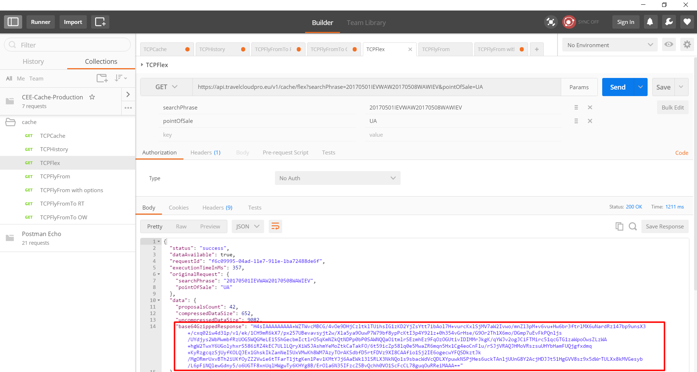
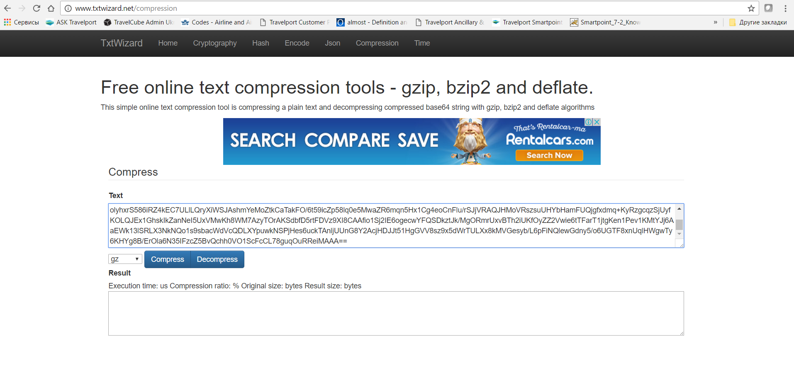
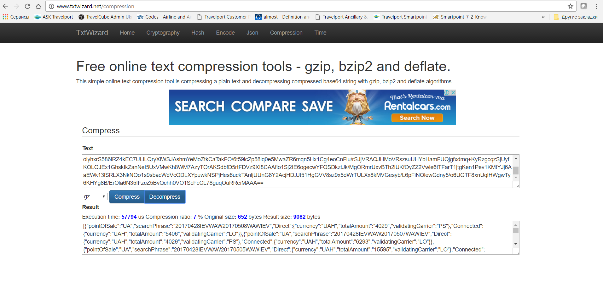
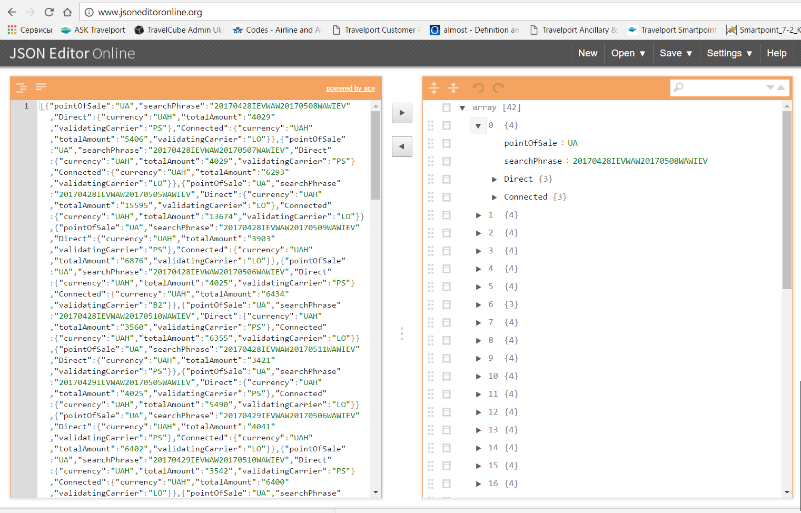

# Using Postman Application

In order to test eStreaming API credentials and confirm connectivity [Postman](https://www.getpostman.com/) can be used.

1. Open Cache folder in Collections Section.

2.Select the required method for sending eStreaming API request. The following subsections provide further insights into the structure of requests and reponses:

| Methods | Description |
| :--- | :--- |
| [Cached API](../methods/cache-api.md) | Allows to aggregate shopping results and build pricing database based on general shopping query with point of sale included. |
| [Historical API](../methods/historical-api.md) | Provides shopping results based on general shopping request within designated time period from specific point \(s\) of sale. Allows to analyze prise fluctuations, off- peak and price jumps for specific destinations |
| [Fly From API](../methods/fly-from-api.md) | Contains the cheapest pricing options for all flights operated from defined city or airport on desirable dates. |
| [Fly From with options API](../methods/fly-from-with-options-api.md) | Provides the lowest price for a selection of destinations from predefined departure point. |
| [Fly From To API](../methods/fly-from-to-api/) | Provides the cheapest pricing options for designated city/airport pair witihin specified time period and desirable minimum/maximum stay days. |
| [Flex API](../methods/fly-from-to-api/) | Provides ability to get the cheapest pricing option for return journey within pre-defined date range |

1. Each eStreaming API GET  request contain a number of required parameters described in detail within the relvant topic. In order to change the default value for each parameter it is necessary to edit the relevant field in Params Section and click Save button when done.

1. Click Send button to transmit new request.
2. Copy the content from base64GzippedResponse field6. Paste it into [TxtWizard](http://www.txtwizard.net/) and click Decompress button

7. Copy the content of Result field and paste it into [JSON Editor](http://www.jsoneditoronline.org/) to view response sctructure:

